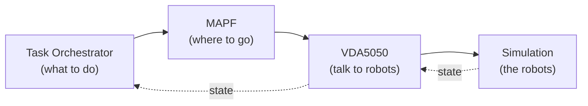
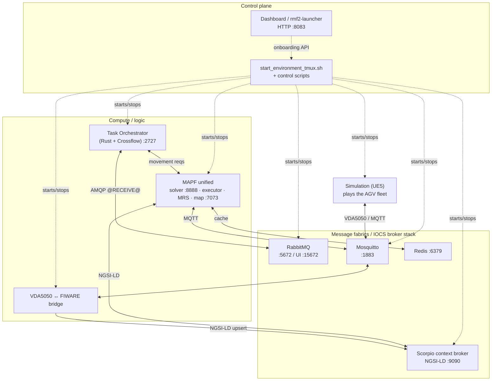
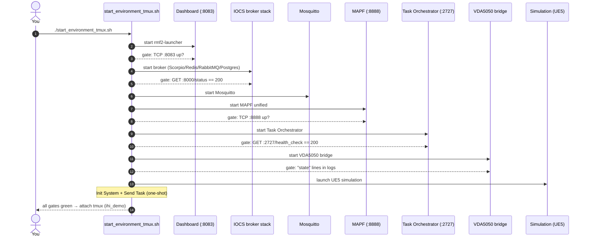
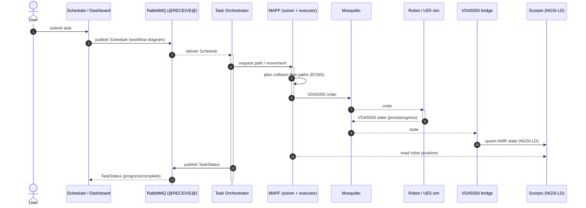
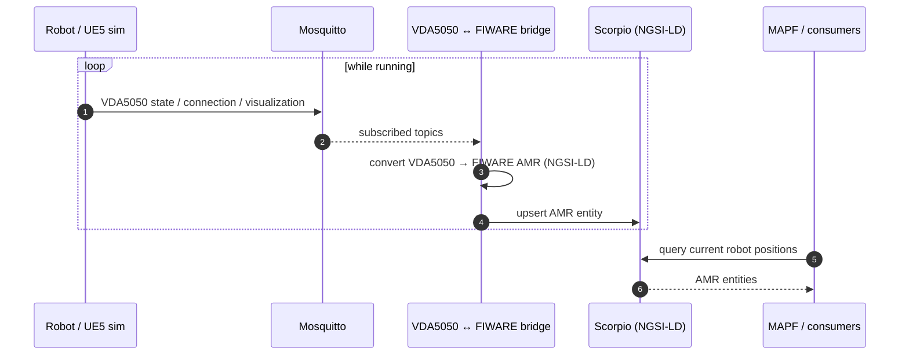

# Architecture

The demo is a set of cooperating Docker containers (plus a UE5 binary) wired together
through three message fabrics:

- **AMQP** — RabbitMQ, for task schedules & status.
- **MQTT** — Mosquitto, for VDA5050 AGV traffic and MAPF coordination.
- **NGSI-LD** — the Scorpio context broker, the single source of truth for robot state,
  maps, and tasks (FIWARE AMR data model).

This page builds your mental model top-down: first the modules, then **sequence
diagrams** of how they talk during startup, task execution, and telemetry.

## The big picture (4 modules)

At its simplest, the demo is four modules around a shared broker. Tasks flow down into
robot motion; robot state flows back up into the context broker.



Everything is glued together by the **IOCS broker stack** (RabbitMQ for tasks, Mosquitto
for VDA5050/MQTT, Scorpio for FIWARE state). The rest of this page zooms in.

## Modules at a glance



> Every container joins the Docker network **`rmf2_broker_rmf-network`** and addresses
> peers by container hostname (e.g. `mosquitto`, `scorpio`, `rmf2_broker-rabbitmq-1`).

## Message fabrics

| Fabric | Broker | Used for |
| --- | --- | --- |
| **AMQP** | RabbitMQ (`:5672`, UI `:15672`) | Task schedules & status between the scheduler and the Task Orchestrator (exchange `@RECEIVE@`). |
| **MQTT** | Mosquitto (`:1883`, `:1928`, `:1929`) | VDA5050 AGV traffic; MAPF executor/MRS coordination. |
| **NGSI-LD** | Scorpio context broker (`:9090`) | Single source of truth for robot state, maps and tasks (FIWARE AMR data model). |

---

## Sequence 1 — Bringing the environment up

How `start_environment_tmux.sh` starts the stack in order, gating each step on a health
check before moving on. (See [Launch scripts](/guide/launch-scripts) for the full step
table.)



If a gate fails, the launcher dumps that pane's last lines and leaves the session
running so you can `tmux attach -t ihi_demo` and inspect.

---

## Sequence 2 — End-to-end task execution

The core loop: a task becomes robot motion, and robot motion becomes updated context.



Key message names are real: the orchestrator subscribes to `Schedule`/`TaskStatus` and
publishes `TaskRequest`/`TaskStatus` on the AMQP `@RECEIVE@` exchange; robots speak
**VDA5050** over MQTT. The exact MAPF↔robot call shapes are shown conceptually.

---

## Sequence 3 — Robot telemetry → context broker

Zooming in on how state continuously flows back into FIWARE (this runs constantly, not
just during a task), which is what closes the loop for monitoring and re-planning.



---

## End-to-end task flow (text)

For quick reference, the same task loop in words:

1. A task is submitted (sample workflow, or `POST :8083/send_task`).
2. The schedule is published over **AMQP** to the **Task Orchestrator**.
3. The orchestrator executes the workflow diagram (Crossflow), requesting paths from
   **MAPF** and issuing movement requests.
4. MAPF plans collision-free paths (ECBS) and the **ADG executor** drives execution.
5. Movement commands reach robots as **VDA5050** orders over **MQTT**.
6. The **VDA5050 ↔ FIWARE bridge** converts robot state back into **NGSI-LD** and stores
   it in **Scorpio**, closing the loop for monitoring and the next planning cycle.
7. In a sim run, the **UE5 simulation** plays the role of the AGVs on the MQTT side.

## Repository layout

```
ros_industrial_ws/
├── ros_industrial_demo/      # integration hub: launch/teardown + compose files
│   ├── launch/               # start_environment_tmux.sh, control scripts, etc.
│   └── compose_files/        # broker / mosquitto / vda5050 compose
├── ros_industrial_demo_docs/ # ← this documentation site (VitePress)
├── mapf_unified_repo/        # MAPF unified container
├── task_orchestrator_repo/   # Rust task orchestrator
├── vda5050_fiware_repo/      # VDA5050 ↔ FIWARE bridge
├── rmf2_broker_repo/         # IOCS broker stack
├── rmf2_launcher_repo/       # dashboard / rmf2-launcher HTTP API
└── simulation/               # UE5 packaged binary (RMF2_new_sim)
```

See [Modules](/modules/mapf) for the deep dive on each box, and
[Ports & networking](/guide/ports) for the authoritative port map.
